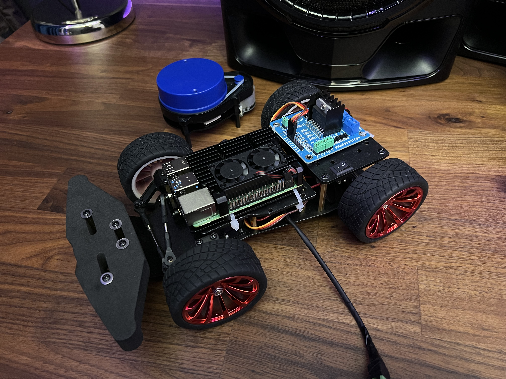

# Project A.I.

The purpose of this project is to create an autonomous self-driving robot, which is able to follow a course and avoid obstacles, all on its own. 
Its inspiration originates from being a big fan of Elon Musk, Tesla and its technology. 
This project is mainly created for PWS (profielwerkstuk) using our own specific hardware, but it can be replicated by the user to work on their hardware as well.

You can visit my social profiles using the following links: 
[Linkedin](https://www.linkedin.com/in/sadra-shameli-35844b1b3) | [Instagram](https://www.instagram.com/sadra_shml/)

## Features

- Fully autonomous driving without any input from the user
- Ability to manually control using a PS4 - PS5 controller
- Ability to manually control using the website created on the local WiFi
- Displaying a 2D model of the surroundings on the website 
- Making use of the well-proven machine learning library [TensorFlow](https://github.com/tensorflow/tensorflow)
- Source code written in both Python and C++ (currently under development)
- Using threads and thread pooling for every core functionality
- Integrating modules to maintain the code better
- Using the latest Raspberry Pi 4B+ for faster operations

## Notes

- Every core functionality of the robot is assigned to a separate thread, all managed in a thread pool. This makes the robot able to:
    - Run the artificial intelligence continuously
    - Automatically connect to a console controller, once available
    - Continuously run the webserver, without interfering with the core functionality
    - Scan the environment with the YDLidar sensor, create a 2D model

## Dependencies
The python code uses different modules to add additional functionalities. These are listed below and can be installed using their respective commands.

[YDLidar SDK](https://github.com/YDLIDAR/YDLidar-SDK) to drive the YDLidar sensor:
```
git clone https://github.com/YDLIDAR/YDLidar-SDK.git
cd YDLidar-SDK
pip install .
```

[RPi GPIO](https://pypi.org/project/RPi.GPIO) to manage and setup the pins on the Raspberry PI:
```
pip install RPi.GPIO
```

[netifaces](https://pypi.org/project/netifaces/) to provide network access
```
pip install netifaces
```

[pyPS4Controller](https://pypi.org/project/pyPS4Controller) to connect and control a PS4 - PS5 controller
```
pip install pyPS4Controller
```

## Change Log

- Sep 11, 2022
    - Created the C++ project, configured CMake and added [YDLidar SDK library](https://github.com/YDLIDAR/YDLidar-SDK)
- Sep 15, 2022
    - Initial test of the YDLidar sensor successful
- Sep 17, 2022
    - Added C++ main application interface using singleton pattern
    - Created Lidar class to better manage YDLidar sensor
    - Added timing class to measure the performance of Raspberry Pi using RAII pattern
    - Added a logging system using the well-proven and fast logging library [spdlog](https://github.com/gabime/spdlog)
- Oct 10, 2022
    - Added GPIO library [pigpio](https://github.com/joan2937/pigpio) and created a helper class to manage the pins on Raspberry Pi
    - Created the Driver class to control the robot 
- Oct 12, 2022
    - Created the python code and adopted all functionalities from the C++ code. 
- Nov 15, 2022
    - Created a local website for the robot, with a helper class to serve files, receive and send GET, POST requests
    - Added robot control via the website and a PS4 or PS5 controller

## Development

Currently as of Nov 15, 2022, we are planning to add the following functionalities to the robot in the near future:

- Add environmental data gathering and displaying on the website. For example, sound level measurements, temperature, humanity and more
- Add Webserver support to the C++ source code
- Add console controller support to the C++ source code- 

## Photos

Initial robot development:


Building the robot fully done:


Disclaimer: Please note that this project is currently under development. Various tests are done to make it bug free, but there is always room for error.
Created with ♥ and maintained by Sadra Shameli. All Rights Reserved.