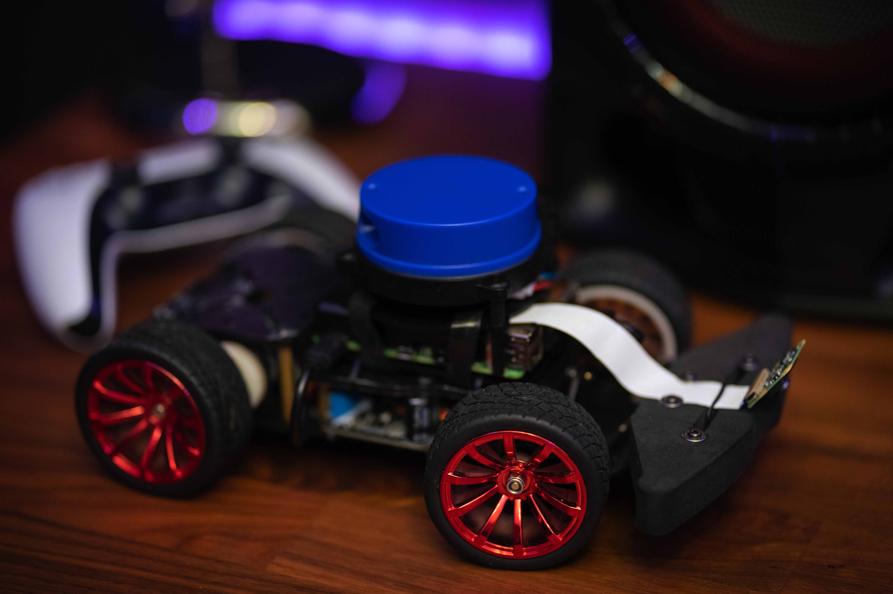

# Project A.I.

The purpose of this project is to create an autonomous self-driving robot, which is able to follow a course and avoid obstacles, all on its own.
Its inspiration originates from being a big fan of Elon Musk, Tesla and its technology.
This project is mainly created for PWS (profielwerkstuk) using our own specific hardware, but it can be replicated by the user to work on their hardware as well.



## Features

- Fully autonomous driving without any input from the user
- Ability to manually control using a PS4 or PS5 controller
- Ability to manually control using the website created on the local WiFi network
- Displaying a 2D model of the surroundings on the website
- Making use of the well-proven machine learning library [TensorFlow](https://github.com/tensorflow/tensorflow)
- Using threads and thread pooling for every core functionality
- Source code written in both Python and C++ (currently under development)

## Notes

- Every core functionality of the robot is assigned to a separate thread, all managed in a thread pool. This makes the robot able to:
  - Run the artificial intelligence continuously
  - Automatically connect to a console controller, once it becomes available
  - Continuously run the web server, without interfering with the core functionality
  - Scan the environment with the YDLidar sensor and create a 2D model

## Installation

To install the latest release, start by cloning this repository. Please don't forget to use the "--recursive" flag when cloning, as this repository uses modules which will not be downloaded otherwise.

```
git clone https://github.com/SadraShameli/ProjectAI --recursive
```

For your convenience, there is a shell script available which will automatically install the required dependencies.

```
cd ProjectAI/
sudo bash Setup.sh
```

To connect to your Raspberry Pi on a computer using wireless via SSH, please follow these steps on your main computer:

Navigate to the following folder:

```
cd Libraries/RaspberryPiSSH/scripts/
```

Run the following script based on your operating system and follow the instructions on your screen:

Windows:

```
windows-ssh-setup.cmd
```

Linux, MacOS:

```
sudo bash ssh-setup.sh
```

## Dependencies

Note: this step is not required if you have already run the automated shell script from the Installation section to install the dependencies.
The python code uses different modules to add additional functionalities. These modules are listed below and can be installed using the respective commands.

[CMake](https://pypi.org/project/cmake) to build the source code:

```
pip install cmake
```

[swig](https://pypi.org/project/swig/) to build the YDLidar library:

```
pip install swig
```

[YDLidar SDK](https://github.com/YDLIDAR/YDLidar-SDK) to drive the YDLidar sensor:

```
git clone https://github.com/YDLIDAR/YDLidar-SDK.git
cd YDLidar-SDK
pip install .
```

[picamera2](https://pypi.org/project/picamera2) library to setup the camera:

```
pip3 install picamera2
```

[opencv-python](https://pypi.org/project/opencv-python) library to setup the camera:

```
pip install opencv-python
```

[pigpio](https://pypi.org/project/pigpio) to manage and setup the pins on the Raspberry PI:

```
pip install pigpio
sudo systemctl enable pigpiod
sudo systemctl start pigpiod
```

[netifaces](https://pypi.org/project/netifaces) to provide network access:

```
pip install netifaces
```

[pyPS4Controller](https://pypi.org/project/pyPS4Controller) to connect and control a PS4 or PS5 controller:

```
pip install pyPS4Controller
```

[TensorFlow Lite](https://www.tensorflow.org/lite/guide/python) to run the A.I. network and process models:

```
pip install tflite-runtime
```

[matplotlib](https://pypi.org/project/matplotlib) for animating:

```
pip install matplotlib
```

## Change Log

- Sep 11, 2022
  - Created the C++ project, configured CMake and added [YDLidar SDK](https://github.com/YDLIDAR/YDLidar-SDK) library
- Sep 15, 2022
  - Initial test of the YDLidar sensor successful
- Sep 17, 2022
  - Added C++ main application interface using singleton pattern
  - Created Lidar class to better manage YDLidar sensor
  - Added timing class to measure the performance of Raspberry Pi using RAII pattern
  - Added a logging system using the well-proven and fast logging library [spdlog](https://github.com/gabime/spdlog)
- Oct 10, 2022
  - Added GPIO library [pigpio](https://github.com/joan2937/pigpio) and created a helper class to manage the pins on Raspberry Pi
  - Created the Driver class to control the robot
- Oct 12, 2022
  - Created the python code and adopted all functionalities from the C++ code.
- Nov 15, 2022
  - Created a local website for the robot, with a helper class to serve files, receive and send GET, POST requests
  - Added robot control via the website and a PS4 or PS5 controller
- Dec 07, 2022
  - Added camera support to the robot, A.I. now also using the camera.
  - Improvements to the A.I. and the code.
- Dec 08, 2022
  - Fixed the CameraTest.py and Plot.py

## Development

Currently as of Nov 15, 2022, we are planning to add the following functionalities to the robot in the near future:

- Add environmental data gathering and displaying on the website. For example, sound level measurements, temperature, humanity and more
- Add web server support to the C++ source code
- Add console controller support to the C++ source code

---

Disclaimer: Please note that this project is currently under development. Various tests are conducted to make it bug-free, but there is always the possibility of errors.

Created with ♥ and maintained by Sadra Shameli. All Rights Reserved.
